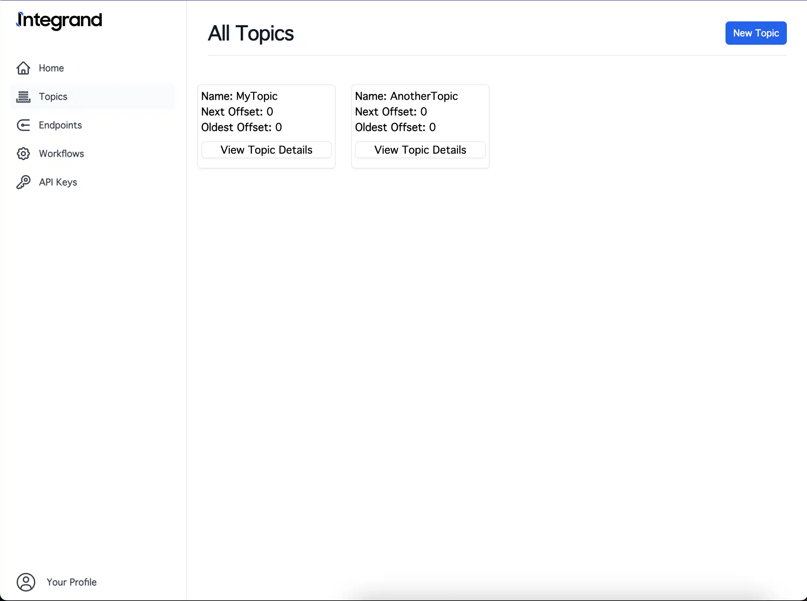
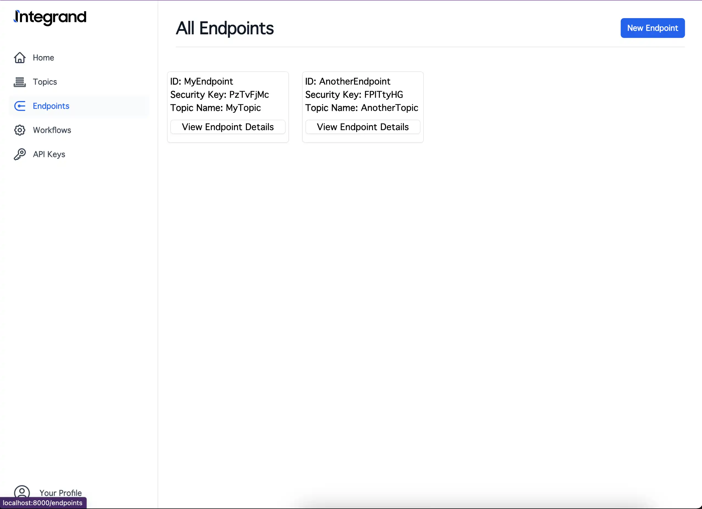
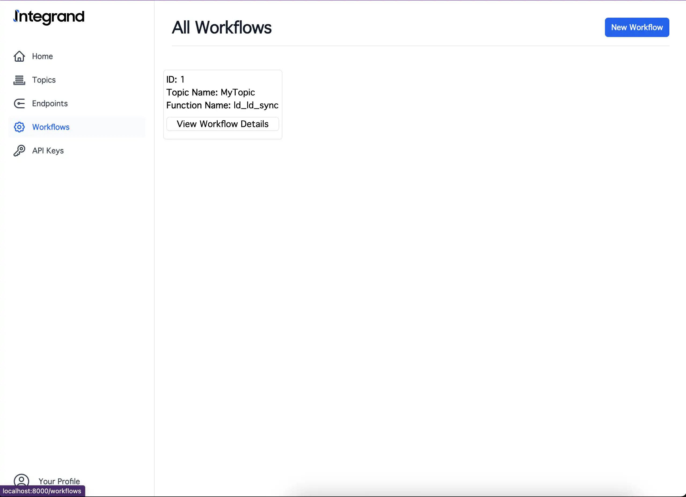
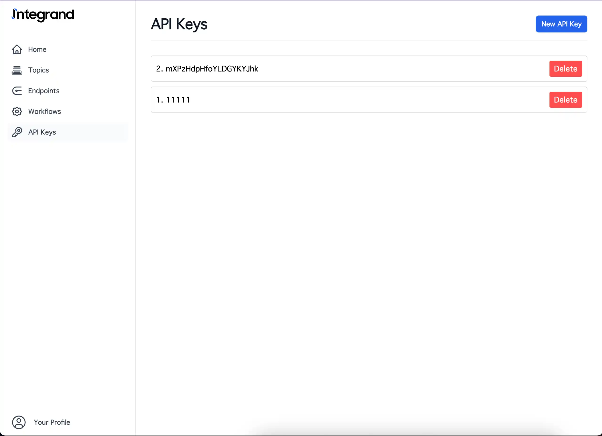

# Integrand

<div align="center">
<p align="center">
    


**Simple-Ops Webhook Streaming. Build your real time integrations without the headache of infrastructure.**

<a href="https://integrand.io">Website</a> •
<a href="https://integrand.io/docs">Documentation</a> 
    


</p>
</div>

> :warning: **This project is in Alpha Stage**: Expect breaking changes

## What is Integrand?

Integrand is an infrastructure tool that focuses on handling webhooks and providing easy to use API's that provide a streaming interface. It enables the creation of stream or queue based applications by providing a rock solid foundation and simple API's.

### Why use Integrand?

Integrand provides abstractions that are similar to other stream/message queue based applications such as Kafka, Rabitmq and others. Event's are the main data structure that are passed though topics which is a logical grouping. Workflows can be created in application that allow events to be worked on in the same process. In a distributed set up, rest like API's are avaliable to create message processors in any other languge.

## Screenshots

| UI Screens                                                       | UI Screens                                                       |
| ----------------------------------------------------------- | ---------------------------------------------------------- |
|   |   |
|  |  |


### Repo Structure

Integrand is a monolith application that contains both backend and frontend making up the application.

    ├── commitlog      # The base library containing code for the commitlog
    ├── persistence    # Contains code for interacting with persistant state
    ├── services       # Wrappers around persistence and other services
    ├── web            # Api and web client code
    ├── utils          # Utils used across the application
    └── data           # Where our persistent data is stored, including SQL definitions

### Goals of Integrand
- Allow integration developers to focus on building robust integrations, not deal with web hook and underlying server infrastructure.

- Developer first. Platforms like Zapier and Robot are great, except when complexity hits. Sometimes you're going to need to create custom code that doesn't need restrictions of another platform.

- Easy to operate as Integrand is self contained. Don't worry about viewing deployment instructions and having to install multiple databases just to get it running. 

## ⚡️ Quick start

The quickest was to get started is to pull down the docker image and get it running on your host. Integrand handles persisting data, so make sure that you have your volumes set up.

### 🐳 Docker
```bash
docker run -d \
      --name integrand \
      -v $PWD/data:/data \
      -p 8000:8000 \
      -e ROOT_EMAIL="test@example.com" \
      -e ROOT_PASSWORD="MyPassword" \
      -e INITIAL_API_KEY="apiKey" \
      registry.vineglue.com/integrand-app:latest
```

### 🐙 Docker Compose:
```yaml
services:
  integrand:
    image: registry.vineglue.com/integrand-app:latest
    restart: unless-stopped
    environment:
      ROOT_EMAIL: "root@example.com"
      ROOT_PASSWORD: "MyPassword"
      INITIAL_API_KEY: "apiKey"
    ports:
      - "8000:8000"
    volumes:
      - data:/data
volumes:
  data:
```

## 🌟 Features

### Stream Based Abstractions
Integrand is built upon the foundations used to build other data intensive systems like Kafka and RabbitMQ. The log is a datastructure that makes practical sense for handling Webhooks from outside services.

### Web Based UI
Manage endpoints, topics and access via a clean, easy to use Web UI. Built using native web components, don't worry about large dependency trees and nightmare NPM management.

### Programactic Access
Manage your Integrand instance via the provided REST API if you prefer to not to leave your commandline. Regular REST and SSE enpoints are exposed to allow for building of different types of applications and integrations.

The requests are all documented in the docs on the website as well as the  `test-request.txt` file as curl requests.

## Running Locally and Development

### Project Setup
1. Git clone the repo
2. Create directories, `data/commitlog` and `data/databases` in the root of the project.
2. `go run .` from the root directory to start the server.

### Running the Test Suite

The integration test suite is written in Python and requires a Python development environment setup.
See the detailed instructions here:
[Integrand-py](integrand-py/README.md)

This same suite is executed in the CI/CD via Docker Compose. It can also be run locally like so as well:
[Docker Compose File](docker-compose-python-integration.yml)